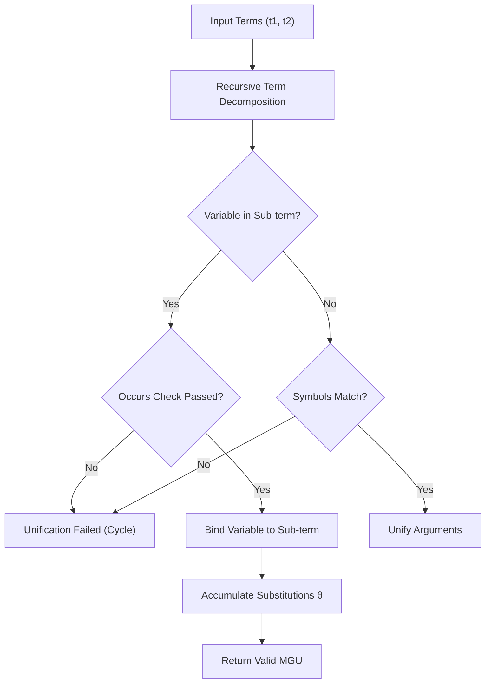

# First-Order Logic Unifier Skill

Robinson's syntactic Most General Unifier (MGU) algorithm with strict occurs-check for automated theorem proving.

## Features
- **100% Python Standard Library**: Recursive syntactic tree traversal.
- **Strict Occurs Check**: Prevents infinite circular term expansions.
- **Composed Substitutions**: Automatic term propagation across nested expressions.
